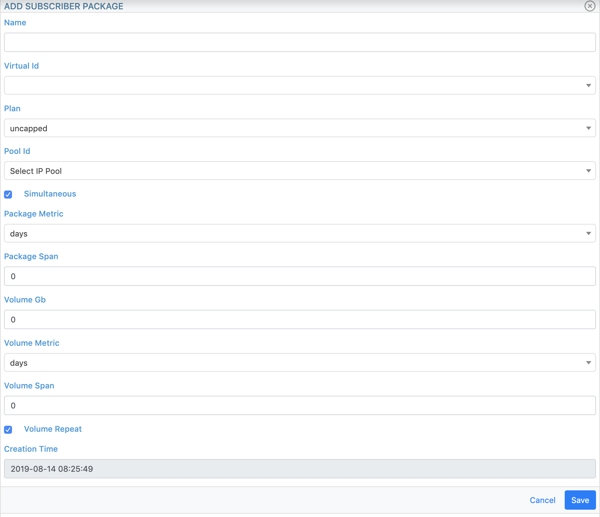

Introduction
============
This document contains the user guide for the :ref:`Calabiyau <about_calabiyau>` User interface.

The Photonic userguide is also available |photonic_userguide|.

.. |photonic_userguide| raw:: html

    <a href="http://tachyonic.org/sphinx/photonic/latest/index1.html" target="_blank">online</a>

Virtual Servers
===============
Calabiyau has the concept of virtual servers. It is possible for example to make it appear to the network as if
there are two distinct RADIUS servers, one can for example be used for fixed line subscribers, while the other
for mobile subscribers. In reality, there is however simply one instance of Calabiay RADIUS server, that is
sliced up into virtual servers.

Adding a Virtual RADIUS service is the first step in setting up the system. To add a virtul RADIUS service, navigate to
``Infrastructure -> Subscriber -> Virtual``, and click on the ``New`` Button. Simply enter a name, and click the
``Save`` button

Adding a NAS
------------
To add and assign NAS'es to this virtual server, click in the ``Edit`` button, enter the name, IP, type and Secret, and
click on the ``Add NAS`` button.

When specifying the :ref:`attributes <attributes>` to be returned for a specific :ref:`package <packages>`, only the AVPs
matching this type will be returned for this NAS.

Deleting a NAS
--------------
To remove a NAS from a virtual RADIUS server, navigate to the server at ``Infrastructure -> Subscriber -> Virtual``,
click on the view icon to its right, and then on the ``Edit`` button. At the bottom of the modal window, the
currently associated list of NASes are displayed. Simply hit the delete icon (to the far right) on the NAS
to be removed, and finally on the ``Continue`` button to confirm.

Disconnecting all users on a NAS
--------------------------------
One can disconnect all sessions on a NAS by navigating to ``Infrastructure -> Subscriber -> Virtual``, selecting
the appropriate Virtual Server, clicking on the ``Edit`` button, and finally on the disconnect session icon
to the right of the applicable NAS (second to last icon next to the NAS).

It is also possible to disconnect a specific session, see :ref:`disconnect`.

IP Pools
========
A common scenario for IP address allocation is to create ip pools on NASes like BNGs, and specifying the pool
name to use for ip allocation via RADIUS attribute. In addition to this,
Calabiyau also offers IP allocation by means of pre-specified IP Pools, so that the ``Framed-Address`` RADIUS
attribute can be used for IP allocation.

Pools of arbitrary sizes may be created, and each IP in the pool is pre-created offline, for performance enhancement
purposes. When a :ref:`session <sessions>` making use of this service comes online for the first time, it is instantly allocated
the next available IP address in the pool. When the pool is depleted, syslog messages will indicate so.

.. _create_pool:

Creating an IP Pool
-------------------
To create a new pool, navigate to ``Infrastructure -> Subscriber -> IP Pool`` and click on the ``New`` button. Enter
a name and click on the ``Save`` button.

To add the range, click on the ``Edit`` button, enter the cidr, and make sure the selection box is set to
"Add/Append Prefix" before clicking on the ``Request`` button.

The request to create all the IP addresses in the pool is processed offline, and its duration of course
depends on the size of the prefix. Multiple ranges may be added to a single pool by repeating this process.

Removing a range from an IP Pool
--------------------------------
To remove an IP range from a pool, follow the same instructions as when :ref:`create_pool`, but this time
select "Remove Pool/Prefix" from the drop-down selection box before clicking on the ``Request`` button.

.. _packages:

Packages
========
Packages is a way to define a service to be assigned to a subscriber. It allows for grouping of similar subscribers
that all makes use of the same RADIUS return attributes, for convenience of configuration.

Creating a Package
------------------
To create a new package, navigate to ``Infrastructure -> Subscriber -> Packages`` and click on the ``New`` button.

The following information is configurable:

* Name: the name of the package.
* Virtual ID: To which Virtual RADIUS server this package belongs.
* Plan: Can be Uncapped or Data. Data plans should be used when limiting the volume of traffic that a subscriber is allowed. Uncapped plans allows traversal of unlimited bytes.
* Pool ID: If applicable, select whether subscribers associated to this package should return Framed-IP address from this pool.
* Simultaneous: when this box is checked, a subscriber account may connect more than once from multiple locations. Leave unchecked to prevent multiple simultaneous sessions.
* Package Metric: Select between days, weeks or months.
* Package span: Enter the number for the metric. For example, if the Metric is months, and the span is 1, the package will last for one month.
* Volume GB: Enter the number of Gigabytes for the package. Only applicable to data packages.
* Volume Metric: Select between days, weeks or months. Only applicable to data packages.
* Volume Span: Enter the number for the Volume metric. Only applicable to data packages.
* Volume Repeat: Whether or not the volume should automatically be repeated after the time span has elapsed. If this box is not checked, the package will expire indefinitely after the one-time volume has been reached. When it is checked, and the volume is depleted before the time span has elapsed, the package will be inactive only until the the time span has elapsed, after which the volume count will start anew. Only applicable to data packages.

Finally, click on the ``Save`` button.

.. _modify_package:

Modifying a package
-------------------
To update the details of a package, navigate to ``Infrastructure -> Subscriber -> Packages``
and click on the icon next to the
appropriate package. At the bottom of the package view window, click on the ``Edit`` button to bring up the
Edit view where the details may be updated. Finally click on the ``Save`` button.

.. _attributes:

Configuring RADIUS attributes to be returned by a package
--------------------------------------------------------
To assign the RADIUS attributes to be returned for a specific package, follow the procedure as with
:ref:`modify_package` to reach the "Edit Package" view. At the bottom of the window a table
displays the currently assigned attributes.

To add a return attribute, complete the fields in this order:

* Attribute name: Select from the searchable drop-down list the specific attribute
* Tag: If required, select a tag for the attribute
* Value: The value for this AVP.
* Context: The :ref:`context` for which this AVP is applicable
* Vendor: The Vendor type for which this AVP must be returned.

To delete a specific attribute, simply click on the "delete" icon on the right hand side next
to the attribute in the attributes table.

Removing a package
------------------
To remove a package, navigate to ``Infrastructure -> Subscriber -> Packages``, select the package to be removed by
clicking on its icon, and then the ``Edit`` buton. Click on the ``Remove`` buton at the bottom, and finally on the
``Continue`` button on the confirmation dialog.

Subscribers
===========
This module allows one to create subscriber accounts, for example to use RADIUS to authenticate PPPoE sessions.

.. _create_sub:

Creating a subscriber account
-----------------------------
To create a new subscriber account, navigate to ``Services -> Subscribers`` and click on the ``New`` button.

Enter the following information:

* Package: Select from the created :ref:`packages`, which package should be assigned to the subscriber account. (required)
* Username: The subscriber username used during AAA login. (required)
* Password: The subscriber password used during AAA login. Both PAP and CHAP is supported. (required)
* Email: Email address of the person that owns this subscriber account.
* Name: Name of the person that owns this subscriber account.
* Phone Mobile: Mobile contact number of the person that owns this subscriber account.
* Phone Office: Additional telephone number of the person that owns this subscriber account.
* Designation: Designation of the person that owns this subscriber account.
* Enabled: Whether or not this account is enabled. When this box is not checked, login attempts will receive a Access-Reject.
* Package Expire: The date on which this account should expire. If left blank, this value will be automatically calculated from the selected Package's span.
* Volume expire: For data packages, the date on which the volume for account should expire.
* Static IPv4: If completed this IP address will be returned as a Framed-Address attribute.

Finally click on the ``Save`` button.

Viewing Subscriber Usage statistics
-----------------------------------
When launcing to the "View Subscriber" window by navigating to ``Services -> Subscribers`` and clicking
on the icon next to the appropriate subscriber, four tabs are displayed:

* Configuration: Currently applied settings for this account.
* Usage: Proportion of package and Top-ups used.
* Daily: Daily upload and download usage in GigaBytes.
* Monthly: Monthly upload and download usage in GigaBytes.

To display only Upload or Download usage, click on the appropriate box above the graph.

.. _modify_sub:

Modifying Subsciber information
-------------------------------
To update subscriber account details, navigate to ``Services -> Subscribers`` and click on the icon next to the
appropriate subscriber. At the bottom of the subscriber view window, click on the ``Edit`` button to bring up the
Edit view where the details may be updated. Finally click on the ``Save`` button.

Removing a Subsriber account
----------------------------
To remove a subscriber account, follow the same procedure as in :ref:`modify_sub` to display the "Edit Subscriber" view.
Click on the ``Remove`` buton at the bottom, and finally on the
``Continue`` button on the confirmation dialog.

.. _sessions:

Sessions
========
This module also includes a table that displays a list of all the current live subscriber sessions.
That is, all the entries in the
calabiyau session table that has last received an accounting packet of type "start" or "interim-update".
In order to prevent the session table from becomming arbitrarily large and having a performance impact,
a background cleanup script periodically removes entries of type "stop" older than a specified time, by default 24 hours.

Viewing live sessions:
----------------------
To view the live subscriber sessions, navigate to ``Infrastructure -> Subscriber -> Sessions``. For each session,
the following columns are displayed:

=============== =======
Column Name     Meaning
=============== =======
Username        The subscriber username
NAS             The IP address of the NAS to which this subscriber is connected
Login@          The time at which the "start" record was received for this session
Updated@        The last time an "accounting" packet was received for this session
Context         The current :ref:`context` of this Subscriber
IP              The IP address assigned to the session
Disconnect icon Click on this Icon to disconnect a single session
=============== =======

.. _disconnect:

Disconnecting a subscriber session
----------------------------------
To disconnect a single subscriber session, navigate to ``Infrastructure -> Subscriber -> Sessions`` and locate
the required subscriber session by typing its username in the search box to the top right of the table.
Once the table has updated to show the required account, click on the disconnect icon to the far right of it
to bring op the confirmation dialog box, and finally on the "Continue" button.

This will issue a request to send a RADIUS POD packet to the NAS.

.. _context:

Subscriber context
------------------
Subscriber sessions have one of two states, called context, associated to it:

* login: This is the regular state, and is the case where the package has not expired, or the data volume has not been exceeded.
* deactivate-login: This state is applied whenever a RADIUS accounting packet is received in the case where:
 * The package expiry date is in the past
 * The volume used is more than the volume size.

**For existing sessions**:

* when a session transitions from login to deactivate-login, the deactivate-coa :ref:`attributes <attributes>` of the :ref:`package <packages>` is sent via CoA packet.
* when a session transitions from deactivate-login to login, the activate-coa :ref:`attributes <attributes>` of the :ref:`package <packages>` is sent via CoA packet.

**For new sessions**:

* when a session transitions from login to deactivate-login, the deactivate-login :ref:`attributes <attributes>` of the :ref:`package <packages>` is sent via CoA packet.
* when a session transitions from deactivate-login to login, the login :ref:`attributes <attributes>` of the :ref:`package <packages>` is sent via CoA packet.

